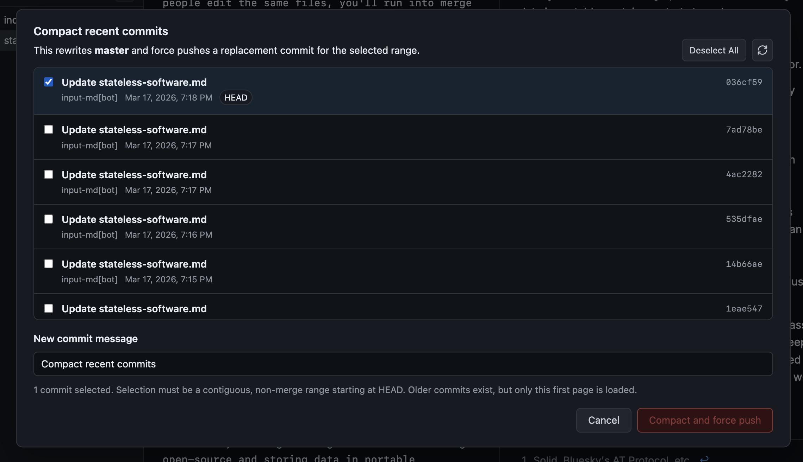

---
fonts:
  - headings: Literata
css: |
  h2, h3, h4, h5, h6 { font-family: Literata; font-weight: 300; }
  h2 { font-size: 28px; border-bottom: none; padding-bottom: 0px; margin-bottom: 0px; }
  h5 {
    font-style: italic;
    font-size: 16px;
    margin-bottom: 24px;
  }
---

## Backendless Software

##### [Raymond Z](https://x.com/selkrei), February 2026

For a long time, hackers and hobbyists have proposed different ways to create software free of corporate overlords or centralized controllers. Many of these systems give users a new, neutral data-portability protocol where they can store their data, which they delegate to different applications.[^1]

[^1]: Some examples include Tim Berners-Lee's Solid, Bluesky's AT Protocol. For the last three years, I also spent most of my time working on [an attempt](https://github.com/canvasxyz/canvas) to make this work. Our approach was to work with a slice of crypto projects that seemed to, at least at the time, care about delivering products and building developer communities and hacker subcultures. Over time, most of them shifted their focus towards gambling and speculation.

With artificial intelligence starting to automate more of the work of building software, I started to wonder, what if we didn't need a new protocol? What if we could use the services and standards we already had?

### Input: A backendless document editor built on GitHub

Input is a document editor, like Obsidian, HackMD, or Notion, that uses GitHub as a backend. It's also a demonstration that AI era applications can use GitHub for data portability and long-term persistence.

Every file on Input is backed by GitHub, and the server is just a caching proxy, so we fetch and render Markdown files as users open them. This means:

- No lock-in: You can easily fork the application, run it locally, or apply custom modifications.
- Interoperable: Input works seamlessly with any tool connected to GitHub, such as Claude Code, Cursor Agents, or Obsidian.
- Open data: All content follows open schemas, specifically Markdown with front matter and standard extensions.

### Backendless software

Applications like [Draw.io](https://draw.io) and [tldraw](https://tldraw.io) explored how to build applications without backends early on -- they were complex applications that used a patchwork of APIs to provide persistence through services like Google Drive and Dropbox. Historically, however, these integrations have remained niche. Most software has been inherently hostile to third-party APIs for primary storage. At best, we've gotten a ["file over app"](https://stephango.com/file-over-app) philosophy that keeps data local.

But now, because of AI, people are connecting an ever-growing list of tools to GitHub: Cursor Agents, Claude, Codex, code review tools, test runners, and more. Even non-technical users are starting to pick up Claude Code, and some are even teaching themselves to commit, merge, and push.

AI agents are also collapsing the cost of software development, so that an independent developer can now build and maintain a sophisticated application in a matter of days. We might have more freedom than ever to create high-quality software that doesn't fit within traditional boundaries.

### Distributed data

Still, building backendless software, especially on GitHub, runs into a few recurring problems. One is the complexity of distributed data. Rather than working with a simple local database, you get the GitHub API, which isn't even a clean filesystem abstraction.

GitHub APIs don't give you consistency, which means that it's easy to edit a file and read back an older version. If you want to make atomic, multi-file updates, you have to use the more complex Git Data API, and manually manage change trees. This was totally impractical for regular developers up until early this year.

GitHub APIs are also designed to serve a much smaller number of users than what you'd need for a public-facing application, so you have to cache a meaningful portion of users' requests.

Even after solving these problems, you still have to deal with conflict resolution. If multiple people edit the same files, you'll run into merge conflicts that cannot be solved without user involvement.

These are all problems from a totally different domain than the ones designers and product-oriented software developers are used to thinking about.

But putting that aside for a moment, assistants like Claude and Codex have made it possible to address *most* of these issues. At least, it's possible to use them to create a client-side, local-first data store that closely matches the GitHub API, which is what this application uses. As a result, the application feels about as responsive as Notion (faster in some places, slower in others). Backendless software is possible, and this is the worst the infrastructure will ever be.

_Git leaks through in a few places; one of them is this commit management dashboard, which is useful for checking which commits affected a given file._

### The future of software

Before agents, backendless software couldn't compete with walled-garden, siloed software. But now a designer or engineer can create a complex application in days. The problem now is that there's too much software, and most of it isn't trustworthy or long-lasting.

Could the solution be storing data in portable containers, and making the application open-source? Knowing that my data will remain accessible to me gives me the assurance I need to take a piece of software seriously, both as a user and as a contributor.

The question is almost where this comes from. After working on decentralized infrastructure for a few years, I am more skeptical that it will come from the same people who advocated for decentralized applications or communal software. It seems just as likely it will come from a new kind of organization: a research lab, an AI company, a [subculture](https://cyborgism.wiki/), or some other kind of structure with a new and fresh take, that lets them build this new kind of infrastructure.